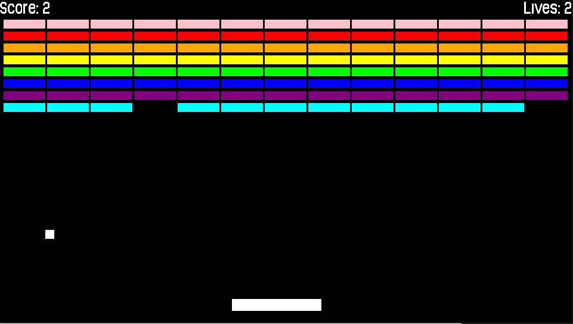

# BreakoutClone
Breakout Clone created for both Windows and PS Vita Platforms (Educational Purposes)



## What's needed
* SDL2 Development Libraries (https://www.libsdl.org/download-2.0.php)
* SDL2 Development TTF Libraries (https://www.libsdl.org/projects/SDL_ttf/)
* PS Vita with CFW installed (https://vita.hacks.guide/)
* PS Vita SDK (https://vitasdk.org/)
* PS Vita Shell (https://github.com/TheOfficialFloW/VitaShell/releases)
* QCMA (https://codestation.github.io/qcma/)

## Windows Build Instructions
1. Install MySys2 MinGW 64-bit (https://www.msys2.org/)
2. Open MySys2 and navigate to `windows` directory
3. Download SDL2 Dev and SDL2 TTF Dev Libraries from **What's needed** section
  * **Note**: Make sure to take note of where these files are installed for the next step.
4. There are 4 variables in the `CMakeLists.txt` file that need to be replaced with the paths on your machine of where the SDL2 ibrary files and include directories are located in order to successfully link the SDL libraries to get an `.exe` file of the game. They are:
```
set(SDL2_INCLUDE_DIR "C:/msys64/usr/include/SDL2.0.16")
set(SDL2_LIBRARY "C:/msys64/usr/lib/SDL2.0.16/x64/SDL2.lib")
set(SDL2_TTF_INCLUDE_DIR "C:/msys64/usr/include/SDL2_TTF-2.0.15")
set(SDL2_TTF_LIBRARY "C:/msys64/usr/lib/SDL2_ttf-2.0.15/lib/x64/SDL2_ttf.lib")
```
5. Change the path for each variable of where you saved the SDL2 include directories and libraries that are enclosed in quotation marks ("")
6. In the MySys2 Terminal, install the `mingw-w64-x86_64-toolchain` (https://packages.msys2.org/group/mingw-w64-x86_64-toolchain)
```
pacman -S mingw-w64-x86_64-toolchain
```
7. In the MySys2 Terminal, type in:
```
./compile.sh
```
8. The above shell script will automatically call CMake Commands to create the game's `.exe` file on successful build


## PS Vita Build Instructions
1. Install CFW on PS Vita following link in **What's needed** section
2. Install PS Vita SDK on PC following link in **What's needed** section
   * **Note**: Once PS Vita SDK is installed, it will automatically install all the SDL2 libs for you (See: https://github.com/vitasdk/vdpm/blob/master/include/install-packages.sh for the list of all libs installed)
3. Install QCMA on PC which will allow you to transfer files between PC and PS Vita
4. Using WSL Terminal (Ubuntu on Windows), navigate to the `psvita` directory of this project
5. Type in `cmake .`
6. Type in `make all`
7. Connect PS Vita to PC using USB cable
8. Copy `.vpk` file built located in the `psvita` directory from PC to PS Vita using QCMA.
9. Open Vita Shell app on PS Vita
10. Navigate to `.vpk` file copied over from step 8 and press X to install

## Credits
* Font used from Terrifried Repo (https://github.com/PolyMarsDev/Terri-Fried/blob/master/psvita/src/resources/font.otf)
* Font used from TwinkleBearDev Tutorial (https://www.willusher.io/sdl2%20tutorials/2013/12/18/lesson-6-true-type-fonts-with-sdl_ttf)

## Learning Resources
* https://github.com/vitasdk/samples
* https://www.willusher.io/pages/sdl2/
* https://github.com/PolyMarsDev/Terri-Fried


## Possible Improvements
- [ ] To reduce code repetition of common gameplay logic blocks between psvita and windows builds, store functions such as `initBrickPositions()` and `drawBricks()` in a separate `.cpp` and `.h` file that can be reused by both psvita and windows builds
- [ ] Create an abstraction layer of how controller inputs are received between different platforms. That is, create a generic interface that can be used to poll for input regardless of platform and create wrapper classes around the specific implementation details of the input modules (e.g. SDL2 Input system and PSVita Input system).
